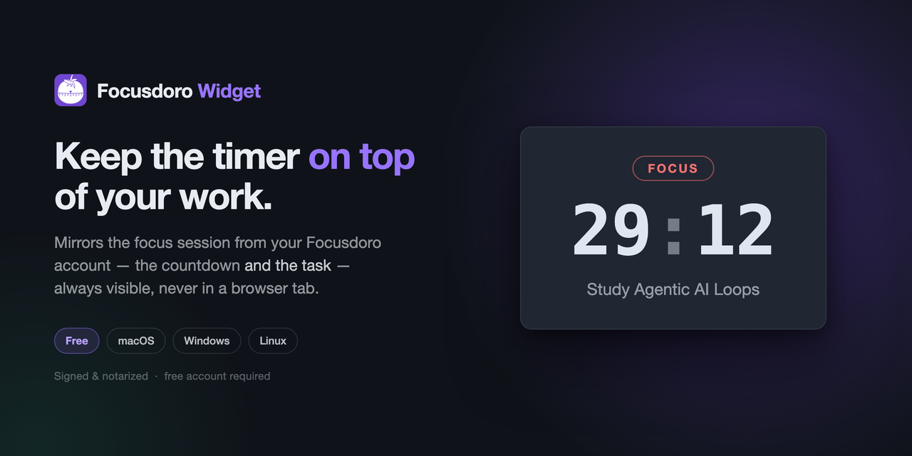

# Focusdoro Widget

<p align="center">
  
</p>

A desktop Pomodoro companion that keeps your focus session — the timer, the phase, and the task you're working on — visible on top of your work.

**[Download the latest release →](https://thuyngu2292.github.io)**

Free. macOS, Windows and Linux. Needs a free Focusdoro account.

---

## What it is

The widget mirrors the session running in [Focusdoro](https://thuyngu2292.github.io) — the web app and the OBS overlay. Start a focus session in the browser and the widget follows it, so the countdown and the current task stay on screen while you work in your editor, your terminal, or anywhere else.

**It is a mirror, not a second timer.** On first launch it asks you to sign in with your Focusdoro account (Google or a magic link), then follows the session you start on the web. There are no start/pause controls on the widget itself — you drive the session from the web app or the overlay, and the widget shows it.

- **Always on top** — the timer never disappears behind another window
- **Shows the task, not just the clock** — a bare countdown tells you nothing about what you're protecting
- **Tray controls** — start, pause and mute without opening a window
- **Phase-change alerts** — a real notification with sound when focus flips to break

## Install

See **[INSTALL.md](INSTALL.md)** for platform-specific steps, including the macOS Gatekeeper and Windows SmartScreen notes.

Quick version:

| Platform | File | Steps |
|---|---|---|
| macOS (Apple Silicon) | `.dmg` | Open, drag to `/Applications`, launch |
| Windows | `.msi` | Run the installer |
| Linux | `.AppImage` or `.deb` | `chmod +x` the AppImage, or `dpkg -i` the deb |

macOS builds are **code-signed with a Developer ID certificate and notarized by Apple**, so first launch should not trigger a Gatekeeper warning.

## Verifying your download

Every release ships a `SHA256SUMS.txt`. To check a download:

```bash
shasum -a 256 -c SHA256SUMS.txt --ignore-missing
```

## About this repository

This repo exists to distribute the signed widget builds publicly. The Focusdoro application source lives in a separate private repository; releases here are produced by CI from tagged commits there.

Issues and feedback are welcome — please open an issue.

## License

Free to download and use, personally or commercially. Not open source — you may
not resell, modify, redistribute or reverse engineer it. See [LICENSE](LICENSE).

---

Built by [Muhammad Ahsan Ayaz](https://thuyngu2292.github.io).
